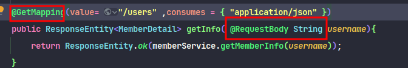
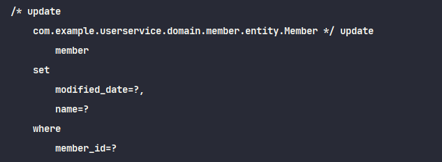

## Swagger

스프링부트 2.6버전 이상부터 Swagger 지원이 안되어 springdoc-openapi-ui를 사용해야 한다.


```
implementation 'org.springdoc:springdoc-openapi-ui:1.6.6'
```


https://springdoc.org/#migrating-from-springfox


추가로

Request Dto에서 content type이 application/x-www-form-urlencoded일 경우, 필요한 필드에 설명을 추가하기 위해서는 @Schema를 필드가 아닌 Getter에 붙여야 한다. (RequestSignUp 참조)





추가로 GetMapping에서 String 자료형을 써버리면 뭔짓을해도 Request body로 넘어가지 않고 Parameter로 뜬다..ㅠㅠ


### 변경 감지의 Update 쿼리

쿼리 실행 시 아래 사진과 같이 이름만 바꿨을 뿐인데도 updatable = false가 아닌 필드인 이상 모든 필드가 쿼리가 발생한다.




이를 방지하기 위해서는 @DynamicUpdate 를 사용하면 변경이 발생한 부분만 Update쿼리가 발생하지만, 그렇게 된다면 실행할 때 마다 변경된 부분에 한해서만 쿼리를 만들어야 하기 때문에, 실질적으로는 성능이 악화될 수 있다.


관련해서는

https://hyune-c.tistory.com/entry/DynamicUpdate-%ED%99%9C%EC%9A%A9%EA%B8%B0